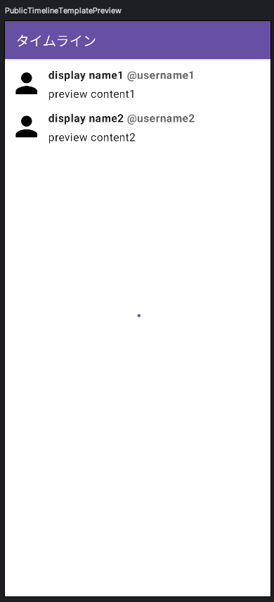
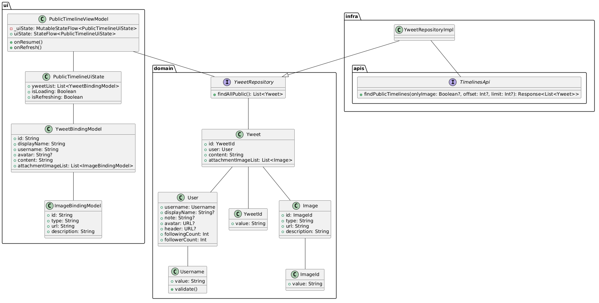

# [前の章へ](../1.はじめに/1_全体概要.md)
# パブリックタイムライン画面の実装
最初に実装する機能はパブリックタイムライン画面です。  
パブリックタイムライン画面は全ユーザーのツイートが流れるタイムライン画面です。  
デザインの指定はありませんが、X(Twitter)のような見た目を目指して実装を進めます。  

## 完成イメージ

## 全体像
パブリックタイムライン画面を開発するにあたって、設計方針にならい次のようなクラス図設計で実装します。

パブリックタイムライン画面には次の要素があります。

- 全ユーザーのツイート表示

次のコースから早速実装に入ります。  
すでに実装済みの機能については、[実装済みの機能](../1.はじめに/2_実装済みの機能.md#2章に関連するもの-パブリックタイムライン画面)を参照してください。

※今回のインターンでは、「ui」と書かれた部分を実装していきます。
その他の部分は`/appendix`に解説があるので、時間がある方は読んでみてください。

# [次の資料](./2_UI層実装.md)