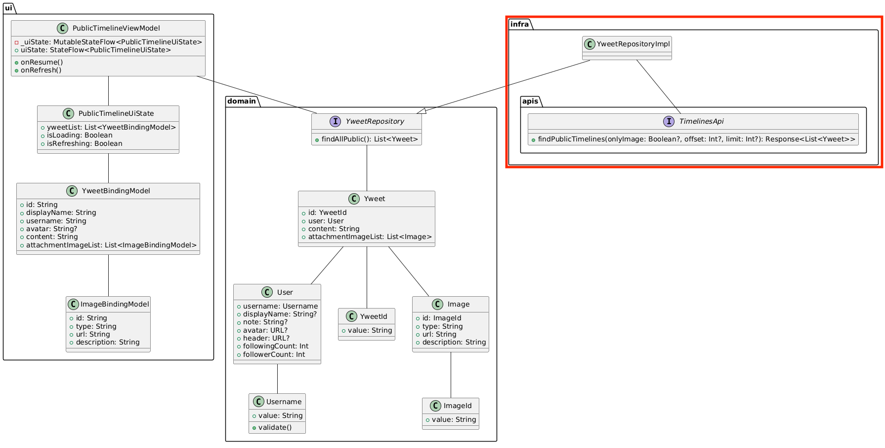

# [前の資料](./1_domain層実装.md)
# パブリックタイムライン画面のinfra層実装
パブリックタイムライン画面のinfra層の実装を行います。 

## infra層の説明
infra層では純粋な技術的関心ごとを実装します。  
domain層で定義したRepositoryやDomainServiceをはじめとするinterfaceの実装もinfra層で具体的な技術を使って実装します。  

クラス図では次に該当します。  


## API接続実装
まずは、APIと接続する部分を実装します。  
今回はOpenAPI Generatorによって自動生成されたAPIクライアントを利用します。  
自動生成されたコードは`api`モジュールの`remote`パッケージ内にあります。

主要なパッケージ・クラスは次の通りです。

- `remote.apis.TimelinesApi` - タイムライン取得API
- `remote.apis.YweetsApi` - ツイート操作API
- `remote.models.Yweet` - APIレスポンスのYweetモデル
- `remote.models.User` - APIレスポンスのUserモデル
- `remote.infrastructure.ApiClient` - APIクライアントの生成クラス

パブリックタイムライン画面で利用するAPIは次のAPIのみです。
```
GET /timelines/public
```

このAPIのレスポンスはJsonで次のような値になっています。

```Json
[
  {
    "id": 123,
    "user": {
      "id": 0,
      "username": "john",
      "display_name": "ジョン",
      "created_at": "2023-05-22T05:23:19.017Z",
      "followers_count": 52,
      "following_count": 128,
      "note": "string",
      "avatar": "string",
      "header": "string"
    },
    "content": "ピタ ゴラ スイッチ♪",
    "created_at": "2023-05-22T05:23:19.017Z",
    "image_attachments": [
      {
        "id": 123,
        "type": "image",
        "url": "string",
        "description": "hoge hoge"
      }
    ]
  }
]
```

このAPIにアクセスするには`TimelinesApi`を使います。  
`TimelinesApi`は自動生成されたコードで、`findPublicTimelines`メソッドでパブリックタイムラインを取得できます。

```Kotlin
// 自動生成されたTimelinesApiの定義（参考）
interface TimelinesApi {
    @GET("timelines/public")
    suspend fun findPublicTimelines(
        @Query("only_image") onlyImage: Boolean? = null,
        @Query("offset") offset: Int? = null,
        @Query("limit") limit: Int? = null
    ): Response<List<Yweet>>
}
```

`ApiClient`を使って`TimelinesApi`のインスタンスを生成できます。

```Kotlin
val timelinesApi: TimelinesApi = ApiClient().createService(TimelinesApi::class.java)
```

## Converterの実装

APIレスポンスの`remote.models.Yweet`をdomain層の`Yweet`ドメインモデルに変換するConverterを実装します。  
`com.dmm.bootcamp.yatter.infra.domain.converter`パッケージを作成し、そこにConverterクラスを追加します。

`Yweet`ドメインモデルが`User`をメンバとして持っているために`User`のConverterが必要になります。

それぞれ次のようになります。  
package通りに配置していってください。

### UserConverter
```Kotlin
package com.dmm.bootcamp.yatter.infra.domain.converter

import com.dmm.bootcamp.yatter.domain.model.User
import com.dmm.bootcamp.yatter.domain.model.UserId
import com.dmm.bootcamp.yatter.domain.model.Username
import java.net.URL
import remote.models.User as ApiUser

object UserConverter {
  fun convertFromApiModel(apiUser: ApiUser) = User(
    id = UserId(apiUser.id.toString()),
    username = Username(apiUser.username),
    displayName = apiUser.displayName,
    note = apiUser.note,
    avatar = apiUser.avatar?.takeIf { it.isNotEmpty() }?.let { URL(it) },
    header = apiUser.header?.takeIf { it.isNotEmpty() }?.let { URL(it) },
    followingCount = apiUser.followingCount,
    followerCount = apiUser.followersCount,
  )
}
```

`avatar`と`header`はAPIレスポンスで空文字が返ってくる場合があるため、空文字の場合は`null`を返すようにしています。  
ここで使われている `?.let { }` は、null でないときだけブロックを実行するイディオムです。詳しくは [Kotlinのスコープ関数について](../../../tutorial/Kotlinのスコープ関数について/1_スコープ関数とは.md) を参照してください。

### YweetConverter
```Kotlin
package com.dmm.bootcamp.yatter.infra.domain.converter

import com.dmm.bootcamp.yatter.domain.model.Yweet
import com.dmm.bootcamp.yatter.domain.model.YweetId
import remote.models.Yweet as ApiYweet

object YweetConverter {
  fun convertFromApiModel(apiYweetList: List<ApiYweet>): List<Yweet> =
    apiYweetList.map { convertFromApiModel(it) }

  fun convertFromApiModel(apiYweet: ApiYweet): Yweet = Yweet(
    id = YweetId(apiYweet.id.toString()),
    user = UserConverter.convertFromApiModel(apiYweet.user),
    content = apiYweet.content,
    attachmentImageList = ImageConverter.convertFromApiModel(apiYweet.imageAttachments)
  )
}
```

これで変換処理の実装が完了しました。

### 前提知識

本章では API 通信や Repository 実装に Coroutine を使います。ただし Coroutine は infra 層だけの話ではなく、domain / usecase / UI 層でも使われます。

**なぜ非同期処理が必要なのか**、**各層で Coroutine をどう使うか** については、次の資料を一読してください。

[Androidアプリ開発における非同期処理](../../tutorial/非同期処理とCoroutineについて.md)

完全に理解する必要はありません。概要を把握したうえで実装を進め、分からない箇所が出たら読み返してください。

---

## Repositoryの実装
`com.dmm.bootcamp.yatter.infra.domain.repository`というパッケージを作成します。  
作成したパッケージに属するように、`YweetRepositoryImpl`クラスを作成し、`YweetRepository`の実装を行います。

```Kotlin
package com.dmm.bootcamp.yatter.infra.domain.repository

import com.dmm.bootcamp.yatter.domain.repository.YweetRepository

class YweetRepositoryImpl(
  private val timelinesApi: TimelinesApi,
) : YweetRepository
```

`YweetRepositoryImpl`で`YweetRepository`内のメソッドの実装を行なっていないため、`class YweetRepositoryImpl`に赤い波線が入っていると思います。赤い波線部にカーソルを当て、「option + return」を押して、`implemention members`を選択します。  
どのメソッドを実装するか確認するダイアログが表示されるため、全てのメソッドを選択しOKを押せば次のようなコードが生成されます。

```Kotlin
class YweetRepositoryImpl(
  private val timelinesApi: TimelinesApi,
) : YweetRepository {
  override suspend fun findById(id: YweetId): Yweet? {
    TODO("Not yet implemented")
  }

  override suspend fun findAllPublic(): List<Yweet> {
    TODO("Not yet implemented")
  }

  override suspend fun findAllHome(): List<Yweet> {
    TODO("Not yet implemented")
  }

  override suspend fun create(content: String, attachmentList: List<File>): Yweet {
    TODO("Not yet implemented")
  }

  override suspend fun delete(yweet: Yweet) {
    TODO("Not yet implemented")
  }
}
```

このメソッドの中で、まずは`findAllPublic`の実装のみを行います。  
他の`TODO`となっているところはそのままでも問題なくビルドは成功します。ですが実行時にはランタイムエラーが出てクラッシュしますので必要になったタイミングで実装しましょう。

`YweetRepositoryImpl#findAllPublic()`を実装するには`timelinesApi`の`findPublicTimelines`を呼び出し、取得したレスポンスのリストをアプリのドメインリストに変換する必要があります。

```Kotlin
override suspend fun findAllPublic(): List<Yweet> = withContext(IO) {
  val response = timelinesApi.findPublicTimelines()
  val body = response.body() ?: return@withContext emptyList()
  YweetConverter.convertFromApiModel(body)
}
```

ここでは、`withContext(Dispatchers.IO)`で処理をラップしていることがわかります。  
詳細は省きますが、アプリのメインスレッド上で、API通信などの時間のかかりうる処理を実行するとその処理が完了するまで他の処理を行えずアプリがフリーズしてしまいます。そのため、データの読み書きに特化したIOスレッドでAPI通信処理を実行するために`withContext(Dispatchers.IO)`でラップしています。

詳細は次のドキュメントを一読しましょう。
https://developer.android.com/kotlin/coroutines/coroutines-adv

---

これでAPI通信するための実装をしました。  
ですが、このままでは実際の通信は行えません。その理由としてはAndroidアプリの権限に起因します。  
Androidアプリ開発時にAndroidスマホ備え付けの機能を利用する際に権限が必要なケースが多くあり、API通信をはじめとするインターネット接続もそのケースに含まれます。

Androidアプリのインターネット接続を許可するためには、`AndroidManifest.xml`というマニフェストファイルに権限を宣言する必要があります。  
マニフェストファイルについては後述しますので、ひとまずは権限を利用するための宣言をする場所くらいの認識で問題ありません。

`AndroidManifest.xml`ファイルを見つけたら次の一文を追加してインターネット接続を許可します。

```XML
<manifest xmlns:android="http://schemas.android.com/apk/res/android"
    xmlns:tools="http://schemas.android.com/tools">

    <!--  追加  -->
    <uses-permission android:name="android.permission.INTERNET" />

    <application ...>

```

## 単体テスト

infra層の実装が完了したら単体テストを書いて処理に問題がないか確認します。  
Androidの単体テストにはJUnitが多く利用されます。  
YatterでもJUnitを使ってテストを書きます。

Androidアプリ開発での単体テストは、`app/src/test/java`ディレクトリ内にテスト対象のクラスと同じパッケージ内に定義します。


今回は`YweetRepositoryImpl`のテストを書くため、`infra/domain/repository`パッケージをtestディレクトリ内にも作成し、作成したパッケージに`YweetRepositoryImplSpec`というクラスも作成します。

Yatterアプリ開発ではテストクラスの命名規則として`${テスト対象クラス名}Spec`という名前にします。  
`Spec`は仕様という意味のある`specification`の略で、テストは仕様であるという意味合いを持たせています。

```Kotlin
class YweetRepositoryImplSpec {}
```

単体テストの実装時にテスト対象クラスが利用する他のクラスはモック化して利用します。  
モック化することによりさまざまなテスト環境を作り出すことができたりテスト対象クラスの振る舞いテストに注力することできます。

モックライブラリとして今回は[`mockk`](https://mockk.io/)を利用します。  
モック化したいクラスを次のような記述をすることでモック化できます。

```Kotlin
val mockClass = mockk<MockClass>()
```

モック化したクラスは次のような記述をしてテストを書きます。

```Kotlin
// モッククラスのメソッド実行時の返り値をモック
every { // 実行するメソッドがsuspendであれば、coEvery
  mockClass.execute()
} returns "foo"

// 返り値のないメソッドを実行できるようにする
justRun {
  mockClass.execute()
}

// モックしたメソッドを実行したか確認
verify { // 実行するメソッドがsuspendであれば、coVerify
  mockClass.execute()
}
```

ここで記載したmockkの使い方は基本的なことのみですので、さらに詳しい実装方法は[公式ページ](https://mockk.io/)をご確認ください。

`YweetRepositoryImpl`は`TimelinesApi`を引数に取るため、それをモック化してテスト対象をインスタンス化します。

```Kotlin
class YweetRepositoryImplSpec {
  private val timelinesApi = mockk<TimelinesApi>()
  private val subject = YweetRepositoryImpl(timelinesApi)
}
```

jUnitでのテストはテストケースごとにメソッドを用意します。  
APIから値を取得し、変換できることを確認します。

```Kotlin
class YweetRepositoryImplSpec {
  private val timelinesApi = mockk<TimelinesApi>()
  private val subject = YweetRepositoryImpl(timelinesApi)

  @Test
  fun getPublicTimelineFromApi() = runTest {
  }
}
```

テストの準備ができたらテスト実装に入ります。  
まずは、テスト用の値とメソッドのモック化です。

```Kotlin
val apiYweetList = listOf(
  ApiYweet(
    id = 1,
    user = ApiUser(
      id = 1,
      username = "username",
      createdAt = OffsetDateTime.now(),
      followersCount = 200,
      followingCount = 100,
      displayName = "display name",
      note = "note",
      avatar = "https://www.google.com",
      header = "https://www.google.com",
    ),
    content = "content",
    createdAt = OffsetDateTime.now(),
    imageAttachments = emptyList(),
  )
)

val expect = listOf(
  Yweet(
    id = YweetId(value = "1"),
    user = User(
      id = UserId("1"),
      username = Username("username"),
      displayName = "display name",
      note = "note",
      avatar = URL("https://www.google.com"),
      header = URL("https://www.google.com"),
      followingCount = 100,
      followerCount = 200
    ),
    content = "content",
    attachmentImageList = emptyList()
  )
)

coEvery {
  timelinesApi.findPublicTimelines(any(), any(), any())
} returns Response.success(apiYweetList)
```

値の準備ができたら、実際に対象のメソッドを呼び出し、結果が取得できていることを確認します。  
ここで利用してる`assertThat`は`Truth`ライブラリのものを利用していますので、`com.google.common.truth.Truth.assertThat`がimportされていることを確認してください。

```Kotlin
val result: List<Yweet> = subject.findAllPublic()

coVerify {
  timelinesApi.findPublicTimelines(any(), any(), any())
}

assertThat(result).isEqualTo(expect)
```

テストが書けたらYatterプロジェクト内で次のコマンドを実行し、テストを走らせます。  
ターミナルアプリを利用しても問題ありませんし、Android Studio内のターミナルを利用しても問題ありません。(Shiftを2回押した後に「terminal」と入力すると出ます)

テストメソッド名かクラス名の左横にある実行ボタンを押すとGUIでもテスト実行できます。

アプリ全体のテストを確認したいときはコマンド、単一のテストメソッドだけをテストしたいときはGUIというように分けても良いでしょう。

```
./gradlew test
```

テストが通過していればinfra層の実装とテストが終了です。  
もし何かしらのエラーやテスト失敗が出ていればエラー内容を確認して対応してみましょう。

テストを実行すると次のファイルにテスト結果ログが出力されます。

```
app/build/reports/tests/testReleaseUnitTest/index.html
```

# [次の資料](./3_DI実装.md)
