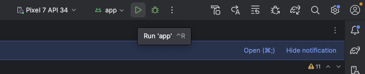

# [前の資料](./2_infra層実装.md)
# パブリックタイムラインのDI実装

UI実装まで完了したらDIの実装を行いパブリックタイムライン画面を仕上げていきます。

Koinの考え方・APIの詳細は、次のインターン資料を先に読んでおくと本章がスムーズです（本章では**パブリックタイムラインに必要な配線だけ**を進めます）。

- [DIについて（概要）](../../../tutorial/DIについて/1_概要.md)
- [AndroidにおけるDI](../../../tutorial/DIについて/2_AndroidにおけるDI.md)
- [Koinを使ったDI](../../../tutorial/DIについて/3_Koinを使ったDI.md)

## Applicationの用意

DI設定はアプリが生存している間残しておきたいため、`Application`サブクラスで行うのが一般的です（[AndroidにおけるDI](../../../tutorial/DIについて/2_AndroidにおけるDI.md) も参照）。

`YatterApplication.kt`というクラスを `com.dmm.bootcamp.yatter` パッケージに作成します。

```Kotlin
package com.dmm.bootcamp.yatter

import android.app.Application

class YatterApplication: Application() {
  override fun onCreate() {
    super.onCreate()
  }
}
```

Applicationクラスを定義したら、アプリが起動したときに定義したApplicationクラスが呼び出されるように定義します。

Activityを追加したときのように `AndroidManifest.xml` ファイルを開きます。
マニフェストファイル内の `<application>` タグの `android:name` 属性に、追加した `YatterApplication`を追記します。

```XML
<application
    android:name=".YatterApplication"
    ...>
```

これでアプリ起動時に `YatterApplication` インスタンスが生成されるようになります。

## Koinの初期化

`YatterApplication#onCreate`内に次を追加します（各設定の意味は [Koinを使ったDI](../../../tutorial/DIについて/3_Koinを使ったDI.md) を参照）。

```Kotlin
startKoin {
  androidLogger()
  androidContext(this@YatterApplication)

  modules(
    modules = listOf()
  )
}
```

---

続いては moduleの設定を行います。
Yatterでは、各レイヤーごとに moduleを作成して管理しやすいようにします。

`com.dmm.bootcamp.yatter.di` パッケージに次のファイルを作成します。

- DomainImplModule
- InfraModule
- ViewModelModule

### DomainImplModule

`DomainImplModule`では domainモジュールで `interface`として定義したものの実装クラスを登録します。

```Kotlin
package com.dmm.bootcamp.yatter.di

internal val domainImplModule = module {
}
```

`module { }`内に、パブリックタイムラインで必要な定義を書きます。`single`や`get()`の使い方は [Koinを使ったDI](../../../tutorial/DIについて/3_Koinを使ったDI.md) を参照してください。

```Kotlin
internal val domainImplModule = module {
  single<YweetRepository> {
    YweetRepositoryImpl(get())
  }
}
```

### InfraModule

`InfraModule`ではAPI接続に必要な各種APIの定義をします。
`DomainImplModule`で定義した`YweetRepositoryImpl`の引数でも必要なものです。

パブリックタイムライン取得用の`TimelinesApi`を定義します。

```Kotlin
internal val infraModule = module {
  single { TokenPreferences(get()) }
  single { TokenInterceptor(get()) }

  // パブリックタイムライン用（認証不要)
  single<TimelinesApi> {
    ApiClient().createService(TimelinesApi::class.java)
  }
}
```

### ViewModelModule

ひとまず下記を `ViewModelModule`にコピーします。

```Kotlin
val viewModelModule = module {
//  viewModel { MainViewModel(get()) }
//  viewModel { PublicTimelineViewModel(get()) }
//  viewModel { PostViewModel(get(), get()) }
//  viewModel { RegisterViewModel(get()) }
//  viewModel { LoginViewModel(get()) }
}
```

今回の実装ではパブリックタイムライン用のViewModelを有効にするため、`PublicTimelineViewModel`の行の `//`を外します。

```Kotlin
internal val viewModelModule = module {
  viewModel { PublicTimelineViewModel(get()) }
}
```

### modulesへの登録

3つの Module設定が完了したら、`YatterApplication`の `modules`に渡します。

```Kotlin
modules(
  modules = listOf(
    domainImplModule,
    infraModule,
    viewModelModule,
  )
)
```

ここまで実装できたらパブリックタイムライン実装は一通り完了です。

Android Studio上部にある `Run app` ボタンからアプリのビルド・実行をして動作を確認してみましょう。



パブリックタイムラインが表示され、Yweetの一覧が表示されれば実装は完了です。

# [次の資料](./4_ViewModelへのテスト追加.md)
