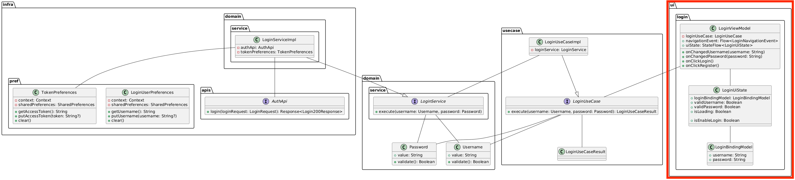
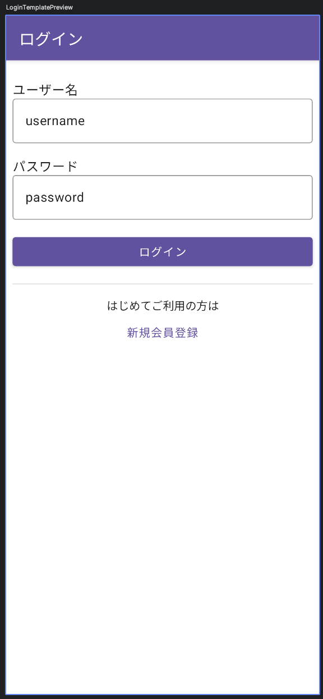
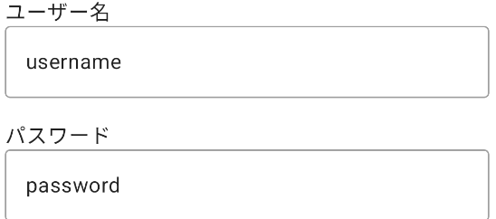
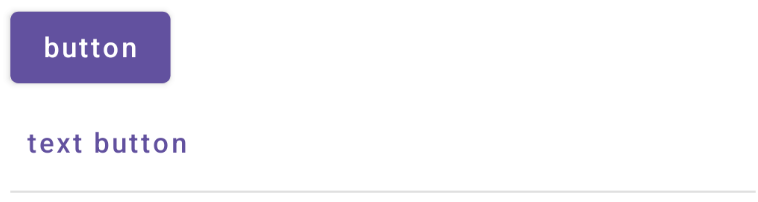

# [前の資料](./1_ログイン機能概要.md)
# ログイン画面のUI層実装
ログイン画面のUI実装を行います。  

クラス図では次に該当します。  



次のような見た目になることを目指して実装します。  



基本的な実装の流れとしては、パブリックタイムライン画面を実装した時と変わりありません。  

## BindingModelの実装
まずは、BindingModelの実装からです。  
`ui/login/bindingmodel`パッケージに`LoginBindingModel`ファイルを作成します。  

ログイン画面で表示する内容としては、ユーザーによって入力されるユーザー名とパスワードの値で、Stringとして保持します。  

```Kotlin
data class LoginBindingModel(
  val username: String,
  val password: String,
)
```

## UiStateの実装
続いては`UiState`の実装です。  
BindingModelと同様に、`ui/login`パッケージ内に`LoginUiState`を用意します。  

パブリックタイムライン画面の時と同様に、`bindingModel`と`isLoading`を用意します。  

```Kotlin
data class LoginUiState(
  val loginBindingModel: LoginBindingModel,
  val isLoading: Boolean,
)
```

ログイン画面ではUiStateにユーザー名やパスワードがきちんと入力されているかどうかというフラグを持たせて、ログイン処理実行可能な状態になってからログインボタンを押せるようにするとユーザーフレンドリーです。  

もちろんUseCase内でも弾いているためUI層で対策しなくても良い内容ですが、ユーザーが利用しやすいように実施します。  

```Kotlin
data class LoginUiState(
  ...
  val validUsername: Boolean,
  val validPassword: Boolean,

) {

  val isEnableLogin: Boolean = validUsername && validPassword

}
```

最後に`LoginUiState`でも初期化用の`empty`メソッドを実装して、`UiState`は完了です。  

```Kotlin
data class LoginUiState(...) {
  companion object {
    fun empty(): LoginUiState = LoginUiState(
      loginBindingModel = LoginBindingModel(
        username = "",
        password = ""
      ),
      isLoading = false,
      validUsername = false,
      validPassword = false,
    )
  }
}
```

## ViewModelの実装
ViewModelの実装に移ります。  
ViewModelの役割については [ViewModelについて](../../tutorial/UI実装に必要な知識/3_ViewModelについて.md) も参照してください。  
`ui/login`パッケージに`LoginViewModel`クラスを作成し、そこに処理を追記していきます。  
ログイン処理では`LoginUseCase`を使用します。

```Kotlin
class LoginViewModel(
  private val loginUseCase: LoginUseCase,
) : ViewModel() {
}
```

まずは、`UiState`を`StateFlow`としてViewModel内で保持します。  
あわせて画面遷移通知用の **`LoginNavigationEvent`** と **`Channel` / `Flow`** を定義します。

```Kotlin
sealed interface LoginNavigationEvent {
  data object LoggedIn : LoginNavigationEvent
  data object NavigatedToRegister : LoginNavigationEvent
}

class LoginViewModel(...) : ViewModel() {
  private val _uiState: MutableStateFlow<LoginUiState> = MutableStateFlow(LoginUiState.empty())
  val uiState: StateFlow<LoginUiState> = _uiState.asStateFlow()

  private val _navigationEvent = Channel<LoginNavigationEvent>(Channel.BUFFERED)
  val navigationEvent: Flow<LoginNavigationEvent> = _navigationEvent.receiveAsFlow()
}
```

UiStateの保持ができたら、イベントメソッドの定義を行います。  

今回用意するイベントメソッドは次の通りです。  

- onChangedUsername(username: String)
- onChangedPassword(password: String) 
- onClickLogin()
- onClickRegister()

`onChanged~`メソッドはテキストボックスにユーザーが文字を入力したときに、UiState内の値を入力された文字に更新するために用意されています。  
パスワードのバリデーションチェックもこのタイミングで行います。  

`onClick~`メソッドはログインボタンや会員登録へ進むためのボタンをユーザーが押下したときに呼び出すメソッドです。  
ログインボタンの場合はログイン処理を、会員登録ボタンは会員登録画面への遷移を実装します。  
会員登録画面の実装自体は解説しないため時間がある時に実装してみてください。  

まずは、メソッドの定義からです。  

```Kotlin
class LoginViewModel(...) : ViewModel() {

  fun onChangedUsername(username: String) {}

  fun onChangedPassword(password: String) {}

  fun onClickLogin() {}

  fun onClickRegister() {}
}
```

後述もしますが、Jetpack Composeでテキスト入力を行うには、`TextField`コンポーザブルを利用します。  
このコンポーザブルの引数に`(String) -> Unit`なラムダ式を渡すことで、ユーザーがテキストボックスで入力・削除した最新の文字列を監視することができます。  

そのため、ユーザー名とパスワードの入力状況を監視するように`onChangedUsername`と`onChangedPassword`メソッドを実装します。  

ラムダ式については次で詳細に説明されているため、興味ある方はご覧ください。  
https://developer.android.com/codelabs/basic-android-kotlin-compose-function-types-and-lambda?hl=ja#0

---

まず、`onChangedUsername`から実装を進めます。  
`onChangedUsername`で行う処理は次の通りです。  

- usernameのバリデーションチェック結果をUiStateに更新
- 新しいusernameの値をUiStateに更新

usernameのバリデーションは以前実装した`UserName#validate`を利用します。  

```Kotlin
fun onChangedUsername(username: String) {
  val snapshotBindingModel = uiState.value.loginBindingModel
  _uiState.update {
    it.copy(
      validUsername = Username(username).validate(),
      loginBindingModel = snapshotBindingModel.copy(
        username = username
      )
    )
  }
}
```

`onChangedPassword`も`onChangedUsername`と同様に実装します。  

```Kotlin
fun onChangedPassword(password: String) {
  val snapshotBindingModel = uiState.value.loginBindingModel
  _uiState.update {
    it.copy(
      validPassword = LoginPassword(password).validate(),
      loginBindingModel = snapshotBindingModel.copy(
        password = password
      )
    )
  }
}
```

続いては`onClickLogin`の実装です。  
`onClickLogin`メソッドでは次の処理を実施します。  

- ローディング状態にする
- ログイン処理(`LoginUseCase`)実行
- ログイン処理成功したらパブリックタイムライン画面へ遷移
- ログイン処理失敗したらエラー表示
- ローディング状態を解除する

これらの処理をコードに落とし込んでいきます。  

まずは、ログイン処理成功時の画面遷移の準備をします。  
画面遷移処理はViewModel内では実施できないため、UI側に「遷移してほしい」ことを伝える手段が必要になります。  

Yatterでは **`Channel<LoginNavigationEvent>`に `send` し、`receiveAsFlow()`で `Flow<LoginNavigationEvent>`として公開**します。`LoginPage`は `LaunchedEffect`で `navigationEvent`を購読し、`MainApp` から渡した `onLoggedIn` / `onNavigateToRegister`を呼びます（バックスタックの更新は `MainApp`が行います）。詳細は[3_導線実装](./3_導線実装.md)を参照してください。

```Kotlin
// Page側（MainApp から onLoggedIn / onNavigateToRegister を渡す想定）
LaunchedEffect(loginViewModel) {
  loginViewModel.navigationEvent.collect { ev ->
    when (ev) {
      LoginNavigationEvent.LoggedIn -> onLoggedIn()
      LoginNavigationEvent.NavigatedToRegister -> onNavigateToRegister()
    }
  }
}
```

画面遷移の準備ができたところで`onClickLogin`メソッドを次の処理手順に従いながら実装します。  

1. ローディング状態にする
2. ログイン処理(`LoginUseCase`)実行
3. ログイン処理成功したらパブリックタイムライン画面へ遷移
4. ログイン処理失敗したらエラー表示
5. ローディング状態を解除する

処理手順をコードに落とし込むと次のような形になります。  

```Kotlin
fun onClickLogin() {
  viewModelScope.launch {
    _uiState.update { it.copy(isLoading = true) } // 1

    val snapBindingModel = uiState.value.loginBindingModel
    when (
      val result =
        loginUseCase.execute(
          Username(snapBindingModel.username),
          LoginPassword(snapBindingModel.password),
        ) // 2
    ) {
      is LoginUseCaseResult.Success -> {
        // 3: ログイン成功をイベントで通知（MainApp が PublicTimelineKey へ遷移）
        _navigationEvent.send(LoginNavigationEvent.LoggedIn)
      }

      is LoginUseCaseResult.Failure -> {
        // 4
        // エラー表示
      }
    }

    _uiState.update { it.copy(isLoading = false) } // 5
  }
}
```

`onClickLogin`までの実装ができたら、続いては`onClickRegister`です。  
ユーザー登録画面へ進むことを `LoginNavigationEvent`で通知します。

```Kotlin
fun onClickRegister() {
  viewModelScope.launch {
    _navigationEvent.send(LoginNavigationEvent.NavigatedToRegister)
  }
}
```

## UI実装
続いてUI側の実装です。  
基本的にはパブリックタイムライン画面を実装した時と同様なクラス・ファイルが必要になります。  
次のファイルを`ui/login`に作成しましょう。  

- LoginPage
- LoginTemplate 

### Composeの実装
ファイルの用意ができたらJetpack ComposeでのUI構築に入ります。  
`@Composable` 関数の基本は [Composable関数について](../../tutorial/Jetpack%20Compose/02-Composable関数について.md) を参照してください。  

`LoginTemplate`コンポーザブルを`LoginTemplate`ファイルに作成し、プレビューコンポーザブルまで用意します。  

```Kotlin
@Composable
fun LoginTemplate() {
}

@Preview
@Composable
private fun LoginTemplatePreview() {
  YatterTheme {
    Surface {
      LoginTemplate()
    }
  }
}
```

ログイン画面で最低限必要な要素としてはユーザー名とパスワードを入力するテキストボックス2つにログイン・ユーザー登録のボタン2つというシンプルな作りです。  

今回は要件を満たしつつ、操作間違いが少なそうな次の見た目を作成することを目指します。  


まずは、`LoginTemplate`の引数を決めます。  
基本的にはパブリックタイムライン画面での引数と同じような流れでを引数を決めます。  
まずは、画面に表示するための`username`・`password`・`isLoading`の3つです。  
そして、今回はテキストボックスに入力されたら実行するラムダ式(`(String) -> Unit`)とボタンを押された時に実行するラムダ式(`() -> Unit`)がありますのでそれぞれ名前をつけて引数に追加します。  
そして、ログインボタンを活性化するための`isEnableLogin`も追加します。  

最終的に引数は次のようになります。
```Kotlin
@Composable
fun LoginTemplate(
  userName: String,
  onChangedUserName: (String) -> Unit,
  password: String,
  onChangedPassword: (String) -> Unit,
  isEnableLogin: Boolean,
  isLoading: Boolean,
  onClickLogin: () -> Unit,
  onClickRegister: () -> Unit,
) {}
```

引数を追加したらPreview側もプレビュー用の仮の値を当てはめます。  

```Kotlin
@Preview
@Composable
fun LoginTemplatePreview() {
  YatterTheme {
    Surface {
      LoginTemplate(
        userName = "username",
        onChangedUserName = {},
        password = "password",
        onChangedPassword = {},
        isEnableLogin = true,
        isLoading = false,
        onClickLogin = {},
        onClickRegister = {},
      )
    }
  }
}
```

引数の用意ができたら実際のUI構築です。  

今回は先に`Scaffold`と`TopBar`の用意をします。  
パブリックタイムライン画面の実装時を思い出しつつ実装してみてください。  

```Kotlin
@Composable
fun LoginTemplate(...) {
  Scaffold(
    topBar = {
      TopAppBar(
        title = {
          Text(text = "ログイン")
        }
      )
    }
  ) { paddingValues -> }
}
```

プレビューを確認すると画面上部にAppBarとログインタイトルが表示されます。  

画面全体ローディング表示ができるように`Box`コンポーザブルを用意しておきます。  
画面全体を覆うようにし、ScaffoldのpaddingValue(it)、画面調整用の`8dp`をpaddingにします。  

```Kotlin
@Composable
fun LoginTemplate(...) {
  Scaffold(...) { paddingValues ->
    Box(
      modifier = Modifier
        .fillMaxSize()
        .padding(paddingValues)
        .padding(8.dp),
    ) {}
  }
}
```

ユーザー名とパスワードを入力するためのテキストボックスと補助用のテキストを縦に並べて表示します。  

Jetpack Composeでテキストボックスを実装するために利用するコンポーザブルにはいくつか種類があります。  
`TextField` の基本は [よく使うComponentについて 〜Text〜](../../tutorial/Jetpack%20Compose/03-よく使うComponentについて%20〜Text〜.md) を参照してください。  
その中でも今回はテキストボックスが枠線で囲われた`OutlinedTextField`を利用します。  
他のテキストボックス用のコンポーザブルも見た目と名前が違うだけで引数や使い方に大きな違いはないため、好きなものを使っても問題ありません。  

`OutlinedTextField`は`value`に現在表示されるテキストの内容、`onValueChange`にユーザーがテキストボックス入力したときに実行される`(String) -> Unit`のラムダを渡すことで入力の変更を検知することができます。  
今回はさらに、`placeholder`引数も利用して、ユーザーが何も入力していない時(入力文字が空文字の時)に表示する補助テキストを表示します。  

`OutlinedTextField`コンポーザブルと`Text`コンポーザブルを利用して入力箇所のUI構築を行います。  
縦方向レイアウトの `Column` については [Row・Column](../../tutorial/Jetpack%20Compose/06-よく使うComponentについて%20〜Row%E3%83%BBColumn%E3%80%9C.md) も参照してください。  
サイズ等は調整していますが、好きな値にしても問題ありません。  

```Kotlin
fun LoginTemplate(...) {
  Scaffold(...) {
    Box(...) {
      Column(modifier = Modifier.fillMaxSize()) {
        Text(
          modifier = Modifier
            .fillMaxWidth()
            .padding(top = 16.dp),
          text = "ユーザー名"
        )
        OutlinedTextField(
          singleLine = true,
          modifier = Modifier
            .fillMaxWidth()
            .padding(bottom = 16.dp),
          value = userName,
          onValueChange = onChangedUserName,
          placeholder = {
            Text(text = "username")
          },
        )

        Text(
          modifier = Modifier.fillMaxWidth(),
          text = "パスワード"
        )
        OutlinedTextField(
          singleLine = true,
          modifier = Modifier
            .fillMaxWidth()
            .padding(bottom = 16.dp),
          value = password,
          onValueChange = onChangedPassword,
          placeholder = {
            Text(text = "password")
          },
        )
      }
    }
  }
}
```



入力箇所の表示ができたら続いてはログインボタン、およびユーザー登録画面への遷移ボタンを配置します。  

新たに3つのコンポーザブルが登場します。  

- Button
- TextButton
- Divider

基本的には名前の通りになりますが、`Button`コンポーザブルは丸角四角形状で塗りつぶしているボタン、`TextButton`は文字ボタンで`Button`コンポーザブルほど目立たせはしないがボタンの動作をするコンポーザブル、そして`Divider`は区切り線になります。  



ログイン画面用にコンポーザブルを組み合わせて実装します。  

```Kotlin
fun LoginTemplate(...) {
  Scaffold(...) {
    Box(...) {
      Column(...) {
        ...
        Button(
          enabled = isEnableLogin,
          onClick = onClickLogin,
          modifier = Modifier
              .fillMaxWidth(),
        ) {
          Text(text = "ログイン")
        }

        Divider(modifier = Modifier.padding(vertical = 16.dp))
        
        Text(
          text = "はじめてご利用の方は",
          modifier = Modifier.fillMaxWidth(),
          textAlign = TextAlign.Center,
          style = MaterialTheme.typography.bodyMedium
        )
        TextButton(
          onClick = onClickRegister,
          modifier = Modifier.fillMaxWidth()
        ) {
          Text(text = "新規ユーザー登録")
        }
      }
    }
  }
}
```

最後にローディングインディケータ表示の実装をします。  
パブリックタイムライン画面でローディング実装をした時と同様に`Box`コンポーザブル内で`isLoading`の状態に合わせて表示します。  

```Kotlin
fun LoginTemplate(...) {
  Scaffold(...) {
    Box(...) {
      Column(...) {...}

      if (isLoading) {
        CircularProgressIndicator()
      }
    }
  }
}
```

---

Templateまで実装できたらPageの実装を行います。  
`Page` と `Template` の役割分担は [パブリックタイムラインのUI層実装](../2.パブリックタイムライン/2_UI層実装.md) の Page/Template 節を参照してください。  
パブリックタイムライン画面と同様にViewModelとTemplateの繋ぎこみを行います。  

`viewModel::メソッド名`のように記述することで、関数オブジェクトを渡すことができます。  
この記法によって、メソッドを変数のように扱うことができるくらいの認識でも問題ありません。  

関数オブジェクトの詳細について知りたい方は次の資料をご一読ください。  
https://developer.android.com/codelabs/basic-android-kotlin-compose-function-types-and-lambda?hl=ja#0

```Kotlin
@Composable
fun LoginPage(
  onLoggedIn: () -> Unit,
  onNavigateToRegister: () -> Unit,
  loginViewModel: LoginViewModel = koinViewModel(),
) {
  val uiState: LoginUiState by loginViewModel.uiState.collectAsStateWithLifecycle()

  LaunchedEffect(loginViewModel) {
    loginViewModel.navigationEvent.collect { navigationEvent ->
      when (navigationEvent) {
        LoginNavigationEvent.LoggedIn -> onLoggedIn()
        LoginNavigationEvent.NavigatedToRegister -> onNavigateToRegister()
      }
    }
  }

  LoginTemplate(
    userName = uiState.loginBindingModel.username,
    onChangedUserName = loginViewModel::onChangedUsername,
    password = uiState.loginBindingModel.password,
    onChangedPassword = loginViewModel::onChangedPassword,
    isEnableLogin = uiState.isEnableLogin,
    isLoading = uiState.isLoading,
    onClickLogin = loginViewModel::onClickLogin,
    onClickRegister = loginViewModel::onClickRegister,
  )
}
```

最後に、`MainActivity`から呼び出します。  

```Kotlin
override fun onCreate(savedInstanceState: Bundle?) {
  super.onCreate(savedInstanceState)

  setContent {
    YatterTheme {
      Surface {
        LoginPage(
          onLoggedIn = {},
          onNavigateToRegister = {},
        )
      }
    }
  }
  ...
}
```

ここまで実装できたらログイン画面のUI実装は完了です。  

# DI設定
Koinの基本は [Koinを使ったDI](../../tutorial/DIについて/3_Koinを使ったDI.md) を参照してください。本章ではログイン画面用の `ViewModel`登録のみ行います。
`di`ディレクトリ内にある`ViewModelModule`というファイルを開きます。  
その中にコメントアウトされている`LoginViewModel`の設定を確認します。  
行の先頭にある`//`を削除してコメントアウトを外し以下のようなコードにしましょう。  

```Kotlin
internal val viewModelModule = module {
//  viewModel { MainViewModel(get()) }
  viewModel { PublicTimelineViewModel(get()) }
//  viewModel { PostViewModel(get(), get()) }
//  viewModel { RegisterViewModel(get()) }
  viewModel { LoginViewModel(get()) } // こちらの//を削除
}
```

エラーが表示されたらパブリックタイムラインの時と同様に、`option + Enter`で解消しましょう。  
エラーが無くなったらRunボタンでアプリが起動することを確認します。  

# [次の資料](./3_導線実装.md)
