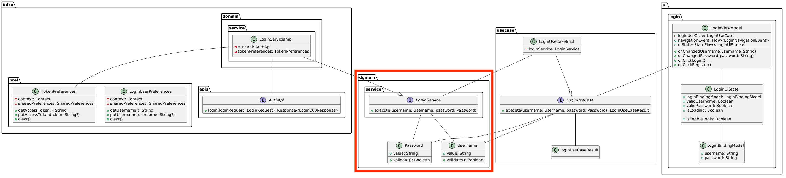

# ログイン画面のdomain層実装
ログイン画面に必要なdomain層の実装を行います。  
ログイン画面に新規実装が必要なdomain層のファイルは次のようになります。  

- domain/Password
- domain/service/LoginService

クラス図では次の箇所にあたります。  


Passwordドメインモデルでは、パスワード文字列を保持しバリデーションチェックを行います。  

LoginServiceドメインサービスでは、ユーザー名とパスワードが問題ないか確認しログイン処理を行います。  

## Passwordドメイン実装

まずは、`Password`ドメインモデルの定義をします。  

`Password`はログイン用と登録用で異なるバリデーションルールがあるため、interfaceとして定義し、それぞれ実装クラスを作成します。

```Kotlin
package com.dmm.bootcamp.yatter.domain.model

interface Password {
  val value: String
  fun validate(): Boolean
}
```

### LoginPasswordの実装

ログイン用の`LoginPassword`を実装します。  
ログイン時のパスワードは空文字でなければ有効とします。

```Kotlin
package com.dmm.bootcamp.yatter.domain.model

data class LoginPassword(override val value: String) : Password {
  override fun validate(): Boolean = value.isNotEmpty()
}
```

### RegisterPasswordの実装

登録用の`RegisterPassword`を実装します。  
パスワードの要件としては、8文字以上で大文字小文字数字の混在、記号の利用があります。

利用可能な記号と文字数を固定値として保持します。

```Kotlin
data class RegisterPassword(override val value: String) : Password {
  companion object {
    private const val SYMBOLS = "/*!@#$%^&*()\"{}_[]|\\?/<>,."
    private const val MIN_LENGTH = 8
  }
}
```

続いて、`大文字`・`小文字`・`記号`・`文字数`をチェックするメソッドを用意しバリデーションチェックをします。

```Kotlin
data class RegisterPassword(override val value: String) : Password {
  companion object {...}

  override fun validate(): Boolean = value.isNotEmpty() &&
    hasUpperCase() &&
    hasLowerCase() &&
    hasSymbol() &&
    hasMinLength()

  fun hasUpperCase(): Boolean = value.toCharArray().any { it.isUpperCase() }

  fun hasLowerCase(): Boolean = value.toCharArray().any { it.isLowerCase() }

  fun hasSymbol(): Boolean = value.toCharArray().any { SYMBOLS.contains(it) }

  fun hasMinLength(): Boolean = value.length >= MIN_LENGTH
}
```

これで`Password`関連ドメインモデルの実装が完了しました。  

`RegisterPassword`ドメインにはロジックが含まれていますので、テストを書いてみましょう。  
`LoginPassword`はシンプルなバリデーションなのでテストも合わせて書きます。

いくつかのケースに応じて`validate`の結果が正しくなるか確認しましょう。

- （RegisterPassword）abc → false
- （RegisterPassword）abcdefghi → false
- （RegisterPassword）Abcdefghi → false
- （RegisterPassword）Abcdefghi10 → false
- （RegisterPassword）Abcdefghi10% → true
- （LoginPassword）"" → false
- （LoginPassword）"a" → true

パブリックタイムライン実装時に書いたテストを参考に`Password`ドメインのテストを書いてみましょう。

<details>
<summary>テストの実装例</summary>

```Kotlin
class PasswordSpec {
  @Test
  fun checkRegisterPasswordValidate() = runTest {
    val testCase = listOf(
      "abc" to false,
      "abcdefghi" to false,
      "Abcdefghi" to false,
      "Abcdefghi10" to false,
      "Abcdefghi10%" to true,
    )

    testCase.forEach {
      assertThat(RegisterPassword(it.first).validate()).isEqualTo(it.second)
    }
  }

  @Test
  fun checkLoginPasswordValidate() = runTest {
    val testCase = listOf(
      "" to false,
      "a" to true,
      "abc" to true,
      "Abcdefghi10%" to true,
    )

    testCase.forEach {
      assertThat(LoginPassword(it.first).validate()).isEqualTo(it.second)
    }
  }
}
```
</details>


## LoginService定義

続いて、`LoginService`の定義を行います。  
`Repository`の時と同様にdomain層ではinterface定義のみ行います。  

```Kotlin
package com.dmm.bootcamp.yatter.domain.service

interface LoginService {
  suspend fun execute(
    username: Username,
    password: Password,
  )
}
```

## CheckLoginService定義
クラス図にはありませんが、
ログイン済みかどうかを判定するために`CheckLoginService`を利用します。template にはすでに実装済みのため、ここではinterface定義を確認します。`MainViewModel`でログイン状況を確認して遷移する画面を制御します。  

`Repository`の時と同様にdomain層ではinterface定義のみ行います。  

```Kotlin
package com.dmm.bootcamp.yatter.domain.service

interface CheckLoginService {
  suspend fun execute(): Boolean
}
```

これで必要なdomain層の実装は完了です。  

# [次の資料](./2_infra層実装.md)