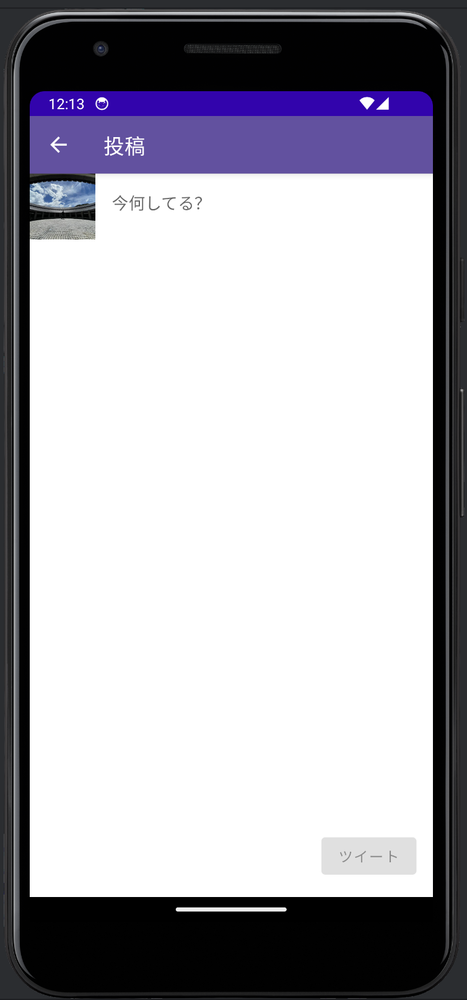

# [前の資料](./1_ツイート機能概要.md)
# ツイート画面のUI層実装
ツイート画面のUI層実装を行います。

画面を閉じる・投稿完了後に戻るといった **画面遷移のトリガー** は、`PostViewModel`が `PostNavigationEvent`を `Flow`で通知し、`PostPage`が `MainApp` から渡された `onPosted` / `onBack`を呼び出す形で行います（バックスタックの更新は `MainApp`の `NavDisplay` 側です）。

## BindingModelの実装
まずはBindingModelの実装からです。  
`ui/post/bindingmodel`パッケージに`PostBindingModel`ファイルを作成し、定義します。  

ツイート画面で表示する内容としては、ツイート主のアイコンとツイート内容をBindingModelが持つようにします。添付画像の URI 一覧も保持します（`Uri`は `android.net.Uri`）。  

```Kotlin
data class PostBindingModel(
  val avatarUrl: String?,
  val yweetText: String,
  val attachmentImageUris: List<Uri> = emptyList(),
)
```

## UiStateの実装
続いて、UiStateの実装です。
`ui/post`パッケージに`PostUiState`クラスを作成しましょう。
UiStateではツイートの投稿内容`PostBindingModel`と読み込み中かを表す`isLoading`、そしてツイートの投稿ができるかどうかの`canPost`を実装します。  
`canPost`は`PostBindingModel#yweetText`が空でない、または画像が1枚以上ある場合に投稿可能とします。

```Kotlin
data class PostUiState(
  val bindingModel: PostBindingModel,
  val isLoading: Boolean,
) {
  companion object {
    fun empty(): PostUiState = PostUiState(
      bindingModel = PostBindingModel(
        avatarUrl = null,
        yweetText = "",
        attachmentImageUris = emptyList(),
      ),
      isLoading = false,
    )
  }

  val canPost: Boolean
    get() = bindingModel.yweetText.isNotBlank() || bindingModel.attachmentImageUris.isNotEmpty()
}
```

## ViewModelの実装
ViewModelの実装に移ります。  
`ui/post`パッケージに`PostViewModel`クラスを作成しましょう。  
投稿用のUseCaseである`PostYweetUseCase`とログインユーザーの情報を取得する`getLoginUserService`も引数に追加します。  

```Kotlin
class PostViewModel(
  private val postYweetUseCase: PostYweetUseCase,
  private val getLoginUserService: GetLoginUserService,
) : ViewModel() {}
```

次に、必要なメソッドを定義します。  
今回は画面の初期起動時にユーザー情報取得する`onCreate`とYweetの内容を書き換えた時に呼び出される`onChangedYweetText`、そして投稿ボタンを押下した時の`onClickPost`を用意します。  
さらにツイート画面ではパブリックタイムライン画面に戻るために、戻るボタン押下時の`onClickNavIcon`を定義します。  

```Kotlin
class PostViewModel(...) : ViewModel() {
  fun onCreate() {}

  fun onChangedYweetText(yweetText: String) {}

  fun onClickPost(context: Context) {}

  fun onClickNavIcon() {}
}
```

ViewModel内のUiStateに加え、**画面を閉じる・投稿完了を通知する**ための `Channel`と `Flow`を定義します。  

```Kotlin
sealed interface PostNavigationEvent {
  data object Posted : PostNavigationEvent
  data object Back : PostNavigationEvent
}

class PostViewModel(...) : ViewModel() {
  private val _uiState: MutableStateFlow<PostUiState> = MutableStateFlow(PostUiState.empty())
  val uiState: StateFlow<PostUiState> = _uiState.asStateFlow()

  private val _navigationEvent = Channel<PostNavigationEvent>(Channel.BUFFERED)
  val navigationEvent: Flow<PostNavigationEvent> = _navigationEvent.receiveAsFlow()
}
```

`onCreate`でユーザー情報取得する部分から実装します。  
`GetLoginUserService`でログイン済みのユーザーを取得し、必要なアバター画像の情報のみをUiStateに更新します。  
読み込みを行うため、`isLoading`も更新してローディング表示するようにしましょう。  

```Kotlin
fun onCreate() {
  viewModelScope.launch {
    _uiState.update { it.copy(isLoading = true) }

    val me = getLoginUserService.execute()

    val snapshotBindingModel = uiState.value.bindingModel
    _uiState.update {
      it.copy(
        bindingModel = snapshotBindingModel.copy(avatarUrl = me?.avatar?.toString()),
        isLoading = false,
      )
    }
  }
}
```

次は、入力された文字列にUiStateを更新するための`onChangedYweetText`の実装です。  

```Kotlin
fun onChangedYweetText(yweetText: String) {
  _uiState.update { it.copy(bindingModel = uiState.value.bindingModel.copy(yweetText = yweetText)) }
}
```

続いては、投稿用のボタン押下時の`onClickPost`の実装です。  
ローディング表示を行い、投稿完了したら **`PostNavigationEvent.Posted`** を送り失敗した場合はそのままにしておきます。添付画像がある場合は `Context` からファイル化するなどの処理が必要になるため、引数に `Context`を取る形にします（教材では処理の流れのみ示し、詳細はこの章で作成する `PostViewModel.kt` に合わせて調整してください）。  

```Kotlin
fun onClickPost(context: Context) {
  viewModelScope.launch {
    _uiState.update { it.copy(isLoading = true) }
    val result = postYweetUseCase.execute(
      content = uiState.value.bindingModel.yweetText,
      attachmentList = listOf()
    )
    when (result) {
      PostYweetUseCaseResult.Success -> {
        _navigationEvent.send(PostNavigationEvent.Posted)
      }
      is PostYweetUseCaseResult.Failure -> {
        // エラー表示
      }
    }
    _uiState.update { it.copy(isLoading = false) }
  }
}
```

戻る用のボタン押下時の`onClickNavIcon`です。  
**`PostNavigationEvent.Back`** を送り、`PostPage` 側で `onBack`を呼んでもらいます。  

```Kotlin
fun onClickNavIcon() {
  viewModelScope.launch {
    _navigationEvent.send(PostNavigationEvent.Back)
  }
}
```

## UI構築
UI構築を行います。  
今までと同様にPage・Templateを作成します。  
パッケージは`ui/post`にします。  

- PostPage
- PostTemplate

### Composeの実装
#### Templateの実装
Templateの実装から始めます。  
`PostTemplate`ファイルに`PostTemplate`コンポーザブルを作成し、プレビューコンポーザブルも定義します。  

```Kotlin
@Composable
fun PostTemplate() {

}

@Preview
@Composable
private fun PostTemplatePreview() {
  YatterTheme {
    Surface() {
      PostTemplate()
    }
  }
}
```

ツイート画面には次の要素が表示されます。  

- TopAppBarの表示
  - ページタイトル
  - 戻るボタン
- 投稿者のアバターアイコン
- 入力中のツイート(Yweet)内容
- 投稿用ボタン

これらの要素を順番に実装していきます。  

まずは、PostTemplateの引数を埋めてコンポーザブル実装中に利用できるようにします。  

引数には次の要素が考えられます。  

- 画面に表示する値
  - PostBindingModel
- ローディングインディケータ表示フラグ
  - Boolean
- 投稿可能フラグ
  - Boolean
- Yweet入力状況監視ラムダ
  - (String) -> Unit
- 投稿ボタン押下ラムダ
  - () -> Unit
- 戻るボタン押下ラムダ
  - () -> Unit

`PostTemplate`の引数にこれらを追加します。  

```Kotlin
@Composable
fun PostTemplate(
  postBindingModel: PostBindingModel,
  isLoading: Boolean,
  canPost: Boolean,
  onYweetTextChanged: (String) -> Unit,
  onClickPost: () -> Unit,
  onClickNavIcon: () -> Unit,
) {}
```

続いてプレビュー側にも引数とテスト用の値を追加します。

```Kotlin
@Preview
@Composable
private fun PostTemplatePreview() {
  YatterTheme {
    Surface {
      PostTemplate(
        postBindingModel = PostBindingModel(
          avatarUrl = "https://avatars.githubusercontent.com/u/19385268?v=4",
          yweetText = "",
          attachmentImageUris = emptyList(),
        ),
        isLoading = false,
        canPost = false,
        onYweetTextChanged = {},
        onClickPost = {},
        onClickNavIcon = {},
      )
    }
  }
}
```


引数を追加できたらまずはTopAppBarの表示から行います。  
他ページ同様にScaffoldコンポーザブルを用意し、TopAppBarを表示します。  

```Kotlin
@Composable
fun PostTemplate(...) {
  Scaffold(
    topBar = {
      TopAppBar(
        title = {
          Text(text = "投稿")
        },
        navigationIcon = {
          IconButton(onClick = onClickNavIcon) {
            Icon(
              imageVector = Icons.AutoMirrored.Filled.ArrowBack,
              contentDescription = "戻る"
            )
          }
        }
      )
    }
  ) {}
}
```

`navigationIcon`が他の画面と比べて増えていると思います。  
この引数にコンポーザブルを渡すことによってTopAppBarのタイトル左横に表示することができます。  

今回は、`IconButton`というアイコン(画像)をボタンとして扱うことのできるコンポーザブルを呼び出し、アイコンに`Icons.AutoMirrored.Filled.ArrowBack`を指定して戻るボタンを実装しています。  

続いては、投稿画面全体とローディングインディケータを表示するための`Box`コンポーザブルを用意して、最大サイズまで拡げコンテンツを画面中央に配置するように指定します。  

```Kotlin
Scaffold(...) {
  Box(
    modifier = Modifier
      .fillMaxSize()
      .padding(it),
    contentAlignment = Alignment.Center,
  ) {}
}
```

それでは、アバターアイコン・ツイート内容・投稿ボタンを並べます。  
実装する画面のイメージを確認するとツイート内容と投稿ボタンが縦に並び、その2つとアバターアイコンが横に並んでいるように考えることができます。  



そのため次のように横方向に並べる`Row`と縦方向に並べる`Column`を組みあせて画面を構成します。  

```Kotlin
Row(...) {
  Column(...) {
    ...
  }
}
```

この配置をもとに、アバターアイコン・ツイート内容・投稿ボタンを配置していきます。  

```Kotlin
Box(...) {
  Row(
    modifier = Modifier
      .fillMaxSize(),
  ) {
    AsyncImage(
      modifier = Modifier.size(64.dp),
      model = postBindingModel.avatarUrl,
      contentDescription = "アバター画像",
      contentScale = ContentScale.Crop,
    )

    Column(
      horizontalAlignment = Alignment.End,
    ) {
      TextField(
        modifier = Modifier
          .fillMaxWidth() // 横幅最大サイズ確保
          .weight(1f), // 他のコンポーザブルのサイズを確保した上で最大サイズを取る
        value = postBindingModel.yweetText,
        onValueChange = onYweetTextChanged,
        colors = TextFieldDefaults.textFieldColors(
          backgroundColor = Color.Transparent,
          focusedIndicatorColor = Color.Transparent,
          unfocusedIndicatorColor = Color.Transparent,
          disabledIndicatorColor = Color.Transparent,
        ), // TextFieldの枠を透明にするための設定
        placeholder = {
          Text(text = "今何してる？")
        },
      )
      Button(
        onClick = onClickPost,
        modifier = Modifier.padding(16.dp),
        enabled = canPost,
      ) {
        Text(text = "ツイート")
      }
    }
  }
}
```

最後にローディングインディケータを配置してTemplateの実装は終了です。  

```Kotlin
Box(...) {
  Row(...)

  if (isLoading) {
    CircularProgressIndicator()
  }
}
```

ここまで実装できたらプレビューを確認して実装できているか確認します。  


#### Pageの実装
Templateの実装が完了したら、Pageの実装に入ります。  
`PostPage`ファイルに`PostPage`コンポーザブルを定義します。  
`MainApp` から **`onPosted`**（投稿完了で前画面へ戻る）と **`onBack`**（戻る操作）を引数で受け取ります。  

```Kotlin
@Composable
fun PostPage(
  onPosted: () -> Unit,
  onBack: () -> Unit,
  postViewModel: PostViewModel = koinViewModel(),
) {
}
```

`PostPage`の定義ができたら、ViewModelとTemplateの繋ぎこみをします。  
繋ぎ込む際に次に示す内容を実装します。  
- `LifecycleEventEffect(ON_CREATE)`で ViewModelの `onCreate`を呼ぶ
- `LaunchedEffect(postViewModel)`で `postViewModel.navigationEvent`を購読し、`PostNavigationEvent.Posted` / `PostNavigationEvent.Back`で `onPosted` / `onBack`を呼ぶ
- ViewModelから`uiState`を取り出し、`PostTemplate`に適した引数を渡す（画像ピッカー等を使う場合は実コードの `PostPage.kt`に合わせる）

> 発展課題として `PostTemplate` の引数を `avatarUrl` や画像添付用ラムダに分割する設計も考えられます。以下は **学習用の簡略版**（前述の `PostTemplate(postBindingModel, ...)`）を前提とした例です。

```kotlin
@Composable
fun PostPage(
  onPosted: () -> Unit,
  onBack: () -> Unit,
  postViewModel: PostViewModel = koinViewModel(),
) {
  val uiState by postViewModel.uiState.collectAsStateWithLifecycle()
  val context = LocalContext.current

  LifecycleEventEffect(event = Lifecycle.Event.ON_CREATE) {
    postViewModel.onCreate()
  }

  LaunchedEffect(postViewModel) {
    postViewModel.navigationEvent.collect { navigationEvent ->
      when (navigationEvent) {
        PostNavigationEvent.Posted -> onPosted()
        PostNavigationEvent.Back -> onBack()
      }
    }
  }

  PostTemplate(
    postBindingModel = uiState.bindingModel,
    isLoading = uiState.isLoading,
    canPost = uiState.canPost,
    onYweetTextChanged = postViewModel::onChangedYweetText,
    onClickPost = { postViewModel.onClickPost(context) },
    onClickNavIcon = postViewModel::onClickNavIcon,
  )
}
```

これでツイート機能画面のUI層実装は完了です。  

# DI設定
Koinの基本は [Koinを使ったDI](../../tutorial/DIについて/3_Koinを使ったDI.md) を参照してください。本章ではツイート画面用の `ViewModel`登録のみ行います。
`di`ディレクトリ内にある`ViewModelModule`というファイルを開きます。  
その中にコメントアウトされている`PostViewModel`の設定を確認します。  
行の先頭にある`//`を削除してコメントアウトを外し以下のようなコードにしましょう。  

```Kotlin
internal val viewModelModule = module {
  viewModel { MainViewModel(get()) }
  viewModel { PublicTimelineViewModel(get()) }
  viewModel { PostViewModel(get(), get()) } // こちらの//を削除
//  viewModel { RegisterViewModel(get()) }
  viewModel { LoginViewModel(get()) }
}
```

必要なimportを行ったらRunボタンでアプリを起動してみましょう。  
起動することを確認できたら次のドキュメントに進みます。  

# [次の資料](./3_導線実装.md)
