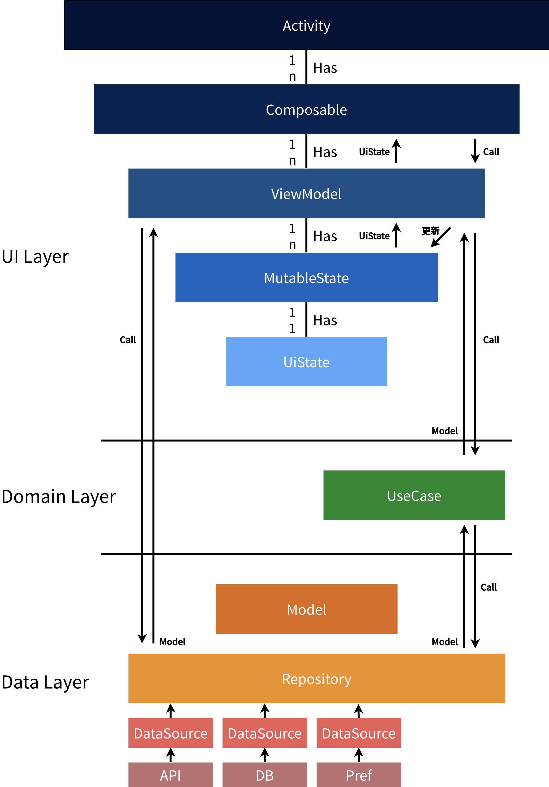
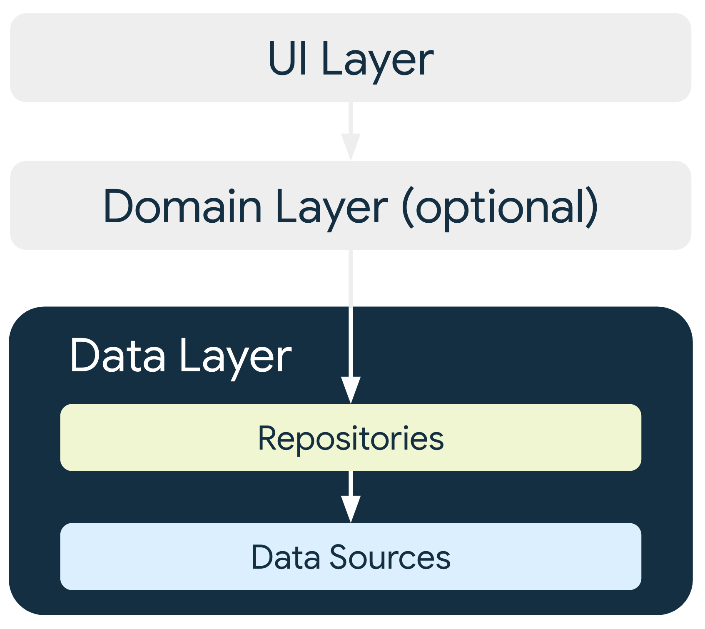
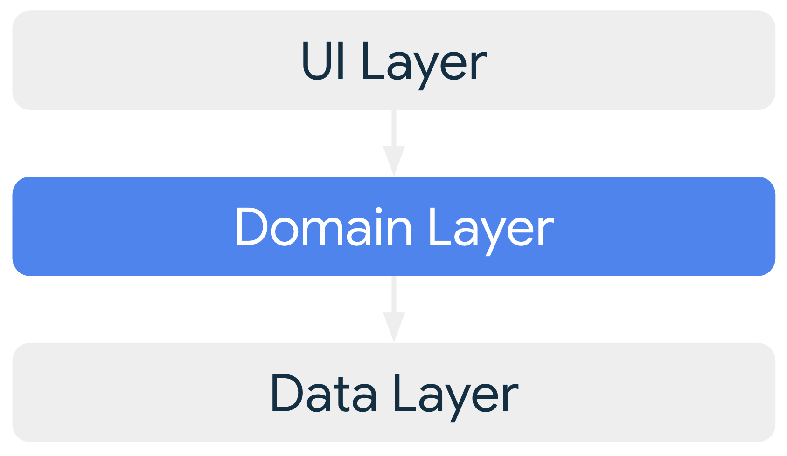
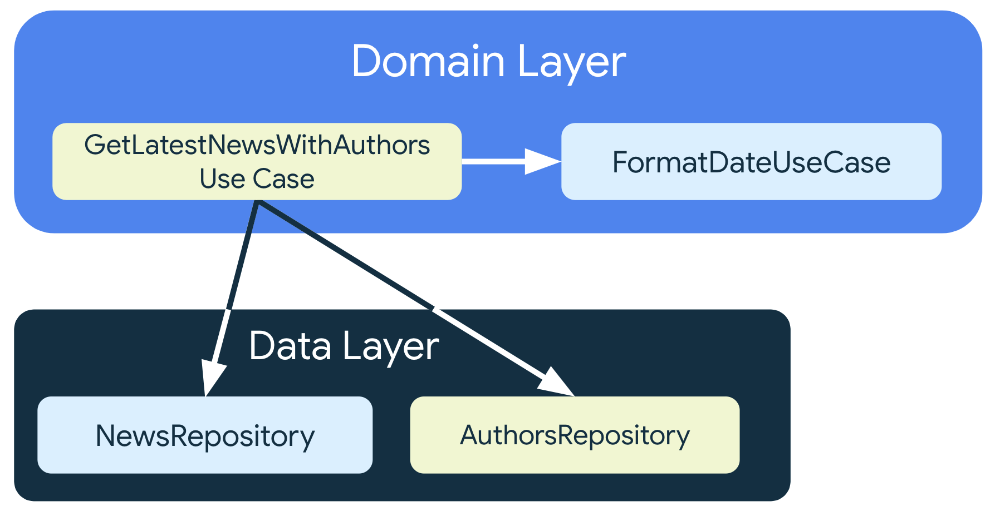

# アプリ アーキテクチャ ガイドについて

[アプリ アーキテクチャ ガイド](https://developer.android.com/topic/architecture?hl=ja)とは、クリーンアーキテクチャやDDDなどを参考にしつつ、GoogleによってAndroidアプリケーション向けに作成されたアーキテクチャガイドです。

本章では、このアーキテクチャ ガイドが説明する推奨アーキテクチャについて説明します。

> [!NOTE]
> 一部の用語・概念は、クリーンアーキテクチャやDDDの原典によって示されたものと異なることがあります。

<br>



<br>

このアーキテクチャでは、以下の3つのレイヤで設計します。

- データレイヤ
- ドメインレイヤ (必要に応じて追加)
- UIレイヤ

## 各レイヤについて

### データレイヤ



<br>

データレイヤは、アプリで扱うデータの構造と、データを取得する方法を定義して公開します。

データは、このレイヤで定義したモデルによって公開され、ストレージやAPI固有の処理をレイヤ内に隠蔽します。

#### Model

`Model`は、アプリで扱うデータ構造を表現します。

例として、やることリストのタスクを表す`Task`モデルを作成します。

```kt
data class Task(
  val id: TaskId,
  val priority: TaskPriority,
  val deadline: TaskDeadline,
  val title: String,
)
```

モデルの各フィールドは不変になるように定義します。

<br>

データの構造は、他のレイヤで扱いやすいように定義します。

例えば各タスクのIDや、タスクの優先度など、APIやデータベースでは文字列や数値で交換するような値も、それぞれモデルとして定義します。

これにより、API上では数値として表されるが、モデルにすると別々の概念となる値を取り違えてしまうミスを防ぐことができます。

```kt
data class TaskId(
  val value: Int,
)

enum class TaskPriority {
  LOW,
  NORMAL,
  HIGH,
}
```

モデル固有の判定処理もモデルに定義します。これにより、モデル固有の処理を見つけることが容易になります。

```kt
sealed class TaskDeadline {
  object Unlimited: TaskDeadline

  data class Limited(
    val deadline: LocalDateTime,
  ): TaskDeadline

  fun isExpired(now: LocalDateTime): Boolean {
    return when (this) {
      is Unlimited -> false
      is Limited -> now > this.deadline
    }
  }
}
```

#### DataSource

`DataSource`は、APIやデータベースからモデルを提供します。

例として、先ほど定義した`Task`モデルをAPIから取得するデータソースを定義します。

```kt
class TaskRemoteDataSource(
  // Swaggerから生成したAPIクライアントなど
  private val taskApi: TaskApi,
) {
  suspend fun fetchLatestTasks(): List<Task> {
    val result = taskApi.getListV1()

    // 変換を行う
    ...
  }
}
```

データソースはモデルの取得元ごとに作成します。これにより、取得元ごとの実装の差異を分離します。

```kt
class TaskLocalDataSource(
  // RoomなどのデータベースDAOなど
  private val taskDao: TaskDao,
) {
  suspend fun fetchTasks(): List<Task> {...}
}
```

Repositoryをテストする際にモックやスタブを実装することが容易になるため、これらは必要に応じてインターフェースと実装に分離します。

#### Repository

`Repository`は、`DataSource`を使用して、データをUIレイヤ、ドメインレイヤに公開します。

例として、先ほど定義した二つのデータソースを使用するリポジトリを作成します。

```kt
class TaskRepository(
  private val taskRemoteDataSource: TaskRemoteDataSource,
  private val taskLocalDataSource: TaskLocalDataSource,
) {

  suspend fun getLatestTasks(): List<Task> {
    // ここでDataSourceを呼び出す
    ...
  }
}

```

ワンショットで取得するデータは、suspend関数（非同期処理）で公開します。

例えば1分おきに取得するデータのような、時間の経過で変化するようなデータは、[`Flow`](https://developer.android.com/kotlin/flow?hl=ja)で公開することで、UIレイヤで変化を検知することができます。

<br>

ドメインレイヤをテストする際、モックやスタブを実装することが容易になるため、これらも必要に応じてインターフェースと実装に分離します。

### ドメインレイヤ




<br>

ドメインレイヤは、UIレイヤとデータレイヤの間に位置し、複数種類のデータを束ねたり、複雑な判断を行う必要がある場合、それらを担当します。

ドメインレイヤは必須ではありません。複数のデータソースを組み合わせることがあれば、必要に応じて作成してください。

#### UseCase

`UseCase`は、`Repository`と他の`UseCase`を使用することができます。

<br>



<br>

1つのユースケースは1つの機能だけを担います。また、UseCase自体が内部に変更可能な状態を持つことはありません。

例として、最新のニュースとその筆者を同時に取得するUseCaseを定義します。

```kt
class GetLatestNewsWithAuthorsUseCase(
  private val newsRepository: NewsRepository,
  private val authorsRepository: AuthorsRepository,
  private val formatDateUseCase: FormatDateUseCase,
) {

  suspend operator fun invoke(): List<ArticleWithAuthor> {
    /* ... */
  }
}
```

ここで、Kotlinの`operator`修飾子を利用してinvoke関数を作成しています。これにより、呼び出し側ではインスタンスを関数オブジェクトのように呼び出せます。

また、1つのユースケースは1つの機能だけを担う、というルールを言語機能で実現できます。

```kt
val useCase: GetLatestNewsWithAuthorsUseCase = /* ... */

useCase()
```

### UIレイヤ

UIレイヤは、データレイヤとドメインレイヤから取得したデータを状態として保持し、画面に表示します。

#### UiState
UIレイヤで保持するデータを定義します。

例として、先に定義したモデルと、データがロード中かどうかを持つUiStateを作成します。

```kt
data class TasksUiState(
  val isLoading: Boolean = false,
  val items: List<Task> = listOf(),
)
```

各フィールドは不変になるように定義します。

#### ViewModel

`ViewModel`は状態を保持し、データレイヤとドメインレイヤを呼び出して状態を更新します。

`MutableState`や、`Flow`などを使用して状態を公開することで、Jetpack Composeで作成したUIは、ViewModelの状態が更新された際に表示内容を更新することが可能になります。

例として、先に定義したデータレイヤを呼び出すViewModelを作成します。

```kt
class TasksViewModel(
    private val repository: TaskRepository = /* ... */,
) : ViewModel() {
  var uiState by mutableStateOf(TasksUiState())
      private set

  fun fetchList() {
    viewModelScope.launch {
      try {
        // 代入をトリガーしてUIに更新が伝播する
        uiState = uiState.copy(
          isLoading = true,
        )

        // 時間のかかる取得処理を呼び出す
        val items = repository.getLatestTasks()

        uiState = uiState.copy(
          isLoading = false,
          items = items,
        )
      } catch (e: IOException) {
        uiState = uiState.copy(
          isLoading = false,
        )
        // ...
      }
    }
  }
}
```

ここでMutableStateを保持するuiStateを定義する際に`by`を使っています。
これによって、uiStateへの代入や参照を行った際、MutableStateクラスのsetValue/getValueが自動的に呼び出され、UIレイヤに更新が伝播します。

非同期処理はviewModelScopeを使用します。これにより、ViewModelが破棄される際に自動的にcancelされるようになります。

#### UI

ViewModelの公開する状態を表示します。

例として、先のViewModelを呼び出すComposableのUIを作成します。

```kt
@Composable
fun TasksScreen(
  viewModel: TasksViewModel = viewModel()
) {
  val uiState = viewModel.uiState

  TasksScreen(
    uiState = uiState,
    fetchList = { viewModel.fetchList() },
  )
}

@Composable
private fun TasksScreen(
  uiState: TasksUiState,
  fetchList: () -> Unit,
) {
  // Pull-to-refresh, Column, etc...
}
```

MutableStateの値を読み出すと、自動で購読が行われるため、ViewModelの変更にリアクティブに追従することができます。

Flowなどは`collectAsStateWithLifecycle`などで購読します。

ボタンなどのインタラクションに応じて、ViewModelの関数を呼び出します。

## コンポーネント間の依存関係の管理

DI（依存性注入）を用いることで、レイヤの実装や、レイヤ同士の依存関係を管理できます。

また、これにより、実装とインターフェースを分離し、各レイヤのインターフェースを見通しやすくする、といったことが容易に実現できます。

Android公式では、Hiltライブラリを使用することが推奨されています。小規模のコードだと導入することで却って煩雑になるため、必要に応じて導入してください。

本章では詳細を説明しませんが、詳しく知りたい場合は以下のページをご覧ください。

https://developer.android.com/training/dependency-injection?hl=ja

## 一般的なベスト プラクティス

基本的なものを紹介します。

他にも細かいベストプラクティスがあるため、詳しく知りたい場合は以下のページをご覧ください。

https://developer.android.com/topic/architecture?hl=ja#best-practices

### アプリのコンポーネントにデータを保存しない

Androidアプリは、メモリ不足でOSによって終了させられます。
消えるとユーザーが困るデータはストレージに保存するか、もしくはバックエンドに送信し保存してください。

### Androidクラスへの依存を減らす

RepositoryのインターフェースやModelで、ActivityやContextなどのAndroid固有のクラスに依存することは、なるべく避けてください。

これらのクラスは多数のメソッドを持つため、モックやスタブを作成する手間がかかり、テストが難しくなります。

また、Activity/Contextはライフサイクルが存在するため、破棄された後に使用した際など不具合の原因となります。
