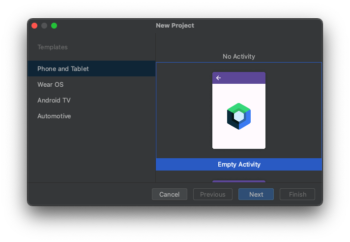
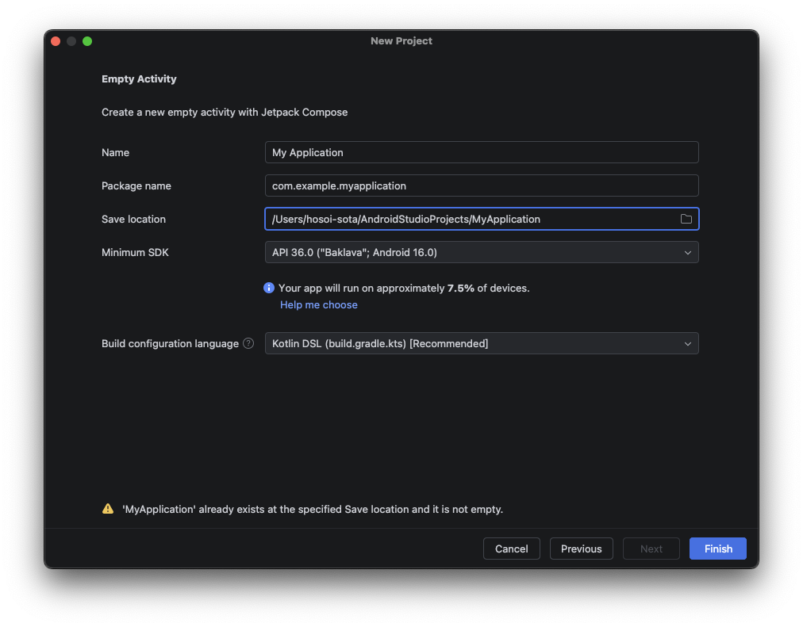
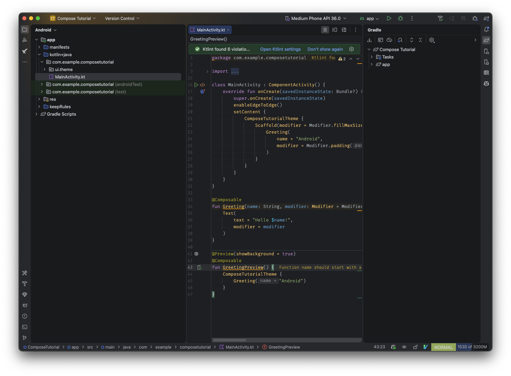

# [前の章へ(UI実装に必要な知識)](../UI実装に必要な知識/1_概要.md)
# はじめに
この資料では、YatterをJetpack Composeで開発する上で基本となる知識を解説します。
Androidのアプリ開発をしたことがない方が、実際にどんなパーツを使ってアプリを作るのかを理解するための資料です。

# Jetpack Composeとは？
Jetpack Composeは数年前に発表され、現在のAndroidアプリ開発においてデファクトスタンダードとっているUI実装のライブラリです。  
宣言的なUI構築方法になっており、UI開発を簡単に・効率良くできます。  

# 学習用プロジェクトのセットアップ
Yatterアプリの実装に入る前に、まずはJetpack Composeの使い方と使える要素について学んでいきます。
まずは学習用のAndroidアプリプロジェクトを作成しましょう。
Android Studioの `File` -> `New` -> `New Project` から新しいプロジェクトを作ります。

今回は `Empty Activity` を選びます。

`Name` と `Package name` はなんでもいいのですが、今回の資料に合わせるため変更せずにそのままにしてください。

`Finish` をクリックすればプロジェクトが作成されます。

一旦セットアップは完了です。

# [次の資料](./02-Composable関数について.md)
