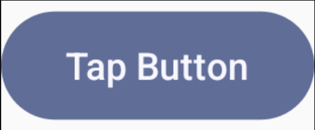
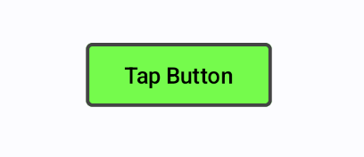
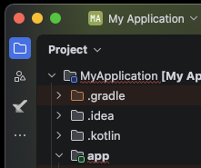
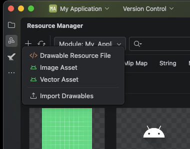
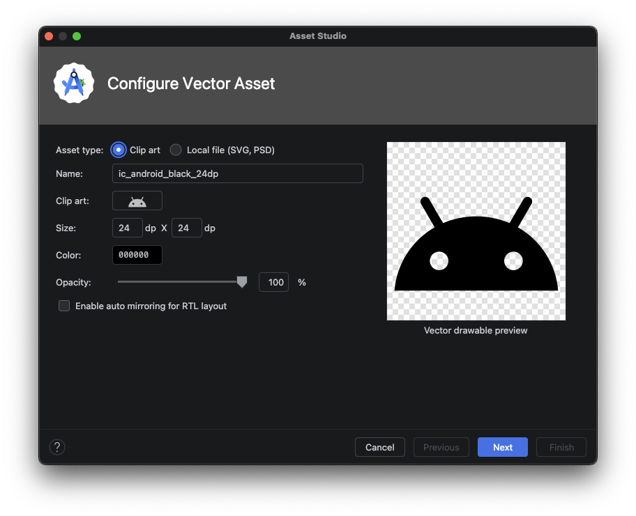
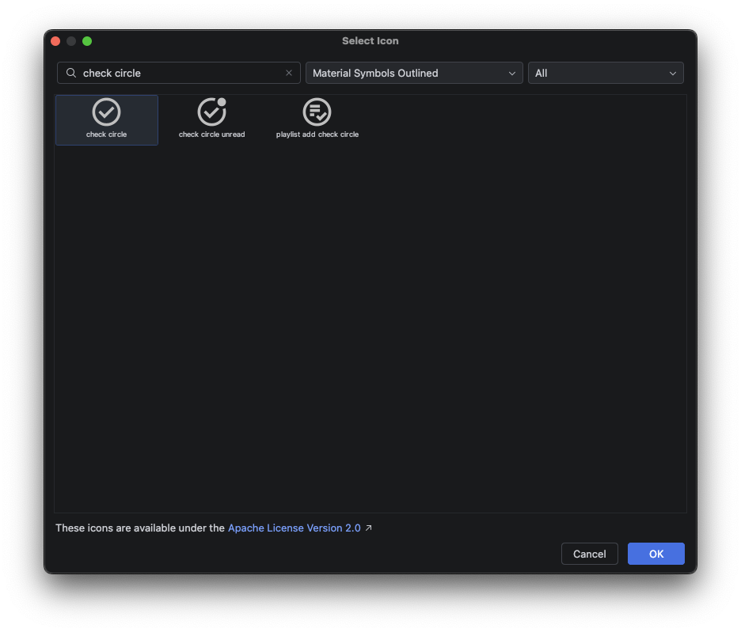
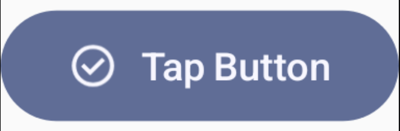

# [前の資料](./03-よく使うComponentについて%20〜Text〜.md)
# よく使うコンポーネントについて 〜Button編〜
## ユーザの入力イベントを受け取りたい
ユーザからの操作を受け付け、クリックイベントを検知するには`Button`コンポーネントを使用します

```kotlin
@Composable
fun ButtonSample() {
    Button(
        onClick = { Log.d("Button", "Clicked") },
    ) {
        Text("Tap Button")
    }
}
```


上記の例では、ボタンをクリックするとアクションとしてログの出力を行います

ユーザからの入力をトリガーとして各処理を行うことで、インタラクティブな機能を提供することができます

赤い波線が出ている人は、compose.material3と書かれているButtonをimportしてください。
以降も、基本的にはComposeやmaterial3と書かれた内容をimportしてください。

## ボタンの見た目を変える
デフォルトの見た目からボタンを変更したい場合、ボタン作成時に以下のような値を設定することで見た目を変えることが可能です

- `shape` : ボタンの枠組みの形を指定
- `border` : ボタンの枠組みの色を指定
- `colors` : `ButtonDefaults.buttonColors()`を渡してボタンの色とテキストの色を指定。

上記のパラメータを指定したプレビューがこちらになります

```kotlin
@Composable
fun ButtonSample() {
    Button(
        onClick = { Log.d("Button", "Clicked") },
            shape = MaterialTheme.shapes.extraSmall, // 枠の形を指定
            border = BorderStroke(2.dp, Color.DarkGray), // 枠の色を指定
            colors = ButtonDefaults.buttonColors(
                containerColor = Color.Green, // ボタンの色を指定
                contentColor = Color.Black // 表示するテキストの色を指定
        )
    ){
        Text("Tap Button")
    }
}
```



また、ボタンにはテキストだけではなくアイコンを追加することも可能です。  
アイコンは、テキストリソースのようにdrawableリソースを参照するように書きます。

```kotlin
@Composable
fun ButtonSample() {
    Button(
        onClick = { Log.d("Button", "Clicked") },
    ) {
        Icon(
            painterResource(id = R.drawable.outline_check_circle_24),
            contentDescription = null,
            modifier = Modifier.size(ButtonDefaults.IconSize)
        )
        Spacer(Modifier.size(ButtonDefaults.IconSpacing))
        Text("Tap Button")
    }
}
```
ここで表示するアイコンは次の手順で追加してください。
1. Resource Managerを開く(Android Studio左上の○◻︎△のボタン)<br>  
2. Vector Assetを選択する<br>
3. Clip artの右のドロイド君のアイコンをタップし、「check circle」を探してOKを押す<br><br>
4. Next → Finishと押す

ある程度単純なアイコンは上記の手順で drawable リソースに追加することができます。
ここにないようなアイコン・画像は 2番目の画像の Import Drawablesを使用することでプロジェクトに追加することができます。


最終的に、プレビューでは次のようなボタンが表示されるでしょう。


# [次の資料](./05-よく使うComponentについて%20〜Image〜.md)
